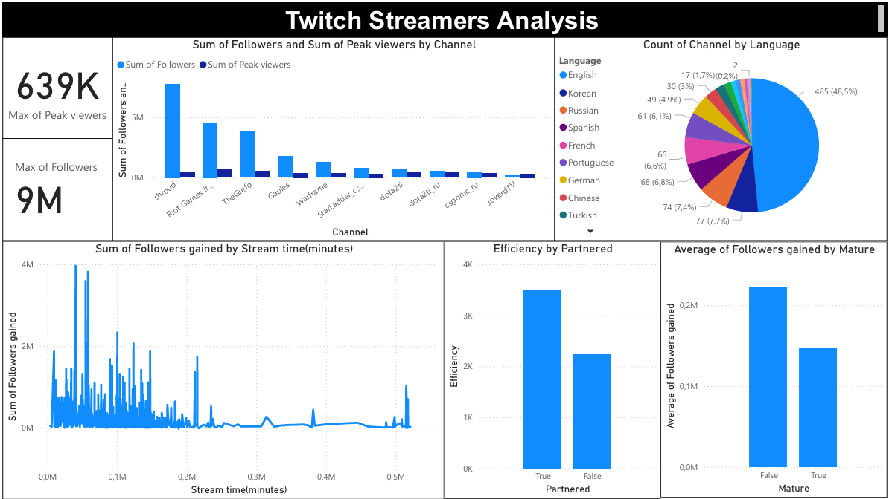

# 📊 Twitch Streamers Analysis

This repository contains an **interactive Power BI dashboard** analyzing Twitch streaming data.  
The goal is to understand how streaming time, language, and streamer status (Partnered / Mature) affect growth and efficiency.

---

## 📌 Dataset
The dataset includes information about Twitch streamers such as:
- **Channel**
- **Watch time (minutes)**
- **Stream time (minutes)**
- **Peak viewers**
- **Average viewers**
- **Followers / Followers gained**
- **Views gained**
- **Partnered / Non-Partnered**
- **Mature / Non-Mature**
- **Language**

---

## 📊 Dashboard Overview

### Key Visualizations:
1. **Top Streamers**  
   - Comparison of *Followers* and *Peak Viewers* by channel.  

2. **Language Distribution**  
   - Pie chart showing the number of channels by language.  

3. **Followers vs Stream Time**  
   - Scatter/line chart to observe the relationship between streaming duration and followers gained.  

4. **Efficiency by Partnered**  
   - Efficiency = `Watch time / Stream time`.  
   - Comparison between Partnered and Non-Partnered streamers.  

5. **Average Followers gained by Mature flag**  
   - Comparison between Mature vs Non-Mature streamers.  

---

## 📈 Insights
- English dominates Twitch content (~48%).  
- Top streamers (e.g., Shroud, Riot Games) gain millions of followers and peak viewers.  
- Partnered streamers show **higher efficiency** than non-partnered ones (~3.5k vs 2.2k).  
- Non-Mature streams tend to gain more followers on average compared to Mature streams.  

---

## 🛠 Tools
- **Power BI** for dashboard creation.  
- **Python (Pandas, Seaborn, Matplotlib)** for initial data exploration.  

---

## 🚀 How to Use
1. Clone this repo.  
2. Open the `.pbix` file in Power BI Desktop.  
3. Explore the interactive visuals.  

---

## 📌 Author
Built with ❤️ by [Your Name]
